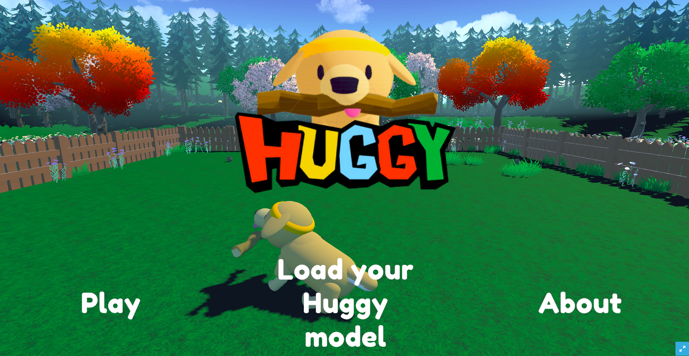

# PPO Huggy Training 🐻  

**My HuggingFace Repo:** [VarmaHF/ppo-HuggyTraining](https://huggingface.co/VarmaHF/ppo-HuggyTraining)  

This repository contains a **trained Proximal Policy Optimization (PPO) agent** playing the **Huggy environment**, built using the **Unity ML-Agents library** and integrated with the Hugging Face Hub.  

The goal of this project was to explore reinforcement learning (RL) with Unity environments and make the trained agent accessible and interactive through Hugging Face.  

---

## 🚀 Usage  

If you’re new to ML-Agents, check out the official [ML-Agents Documentation](https://unity-technologies.github.io/ml-agents/ML-Agents-Toolkit-Documentation/) for setup, installation, and training details.  

You can also dive into Hugging Face’s **[Deep RL Course](https://huggingface.co/learn/deep-rl-course/)** for step-by-step guidance on how to train agents and upload them to the Hub.  

---

## 🎮 Play with your Huggy 🐕  

This is the fun part! You can **interactively play with your trained Huggy agent** directly in your browser:  

👉 Open the Huggy game here: [Huggy on Hugging Face Spaces](https://huggingface.co/spaces/ThomasSimonini/Huggy)  

1. Click **“Play with my Huggy model”**  
2. In **Step 1**, enter your exact Hugging Face username (case-sensitive). Example: `VarmaHF`  
3. In **Step 2**, select the repository: `ppo-HuggyTraining`  
4. In **Step 3**, choose the model checkpoint you want to replay.  

💡 During training, multiple model checkpoints were saved (e.g., every 200,000 timesteps).  
You can try different versions to observe how Huggy improves over time.  
For example, the most recent model file is: **`Huggy.onnx`**  

---

## ⚙️ Huggy Training 

- **Environment**: Huggy (Unity ML-Agents)  
- **Algorithm**: PPO (Proximal Policy Optimization)  
- **Frameworks**: Unity ML-Agents + Hugging Face Hub  
- **Integration**: Model packaged and uploaded to Hugging Face for sharing and deployment 
- **View training metrics on** : [**TensorBoard**](https://huggingface.co/VarmaHF/ppo-HuggyTraining/tensorboard)

---
## How Huggy Learned 🐶

This PPO agent was trained using **Unity ML-Agents** to play Huggy. Here’s a breakdown of what’s happening, both for curious developers and casual observers:

### Training Insights (Tech + RL perspective)

- **Policy Learning:**  
  The agent’s policy gradually improved—early in training, Huggy chose random actions, but over time it learned which moves yield higher rewards.  
- **Reward Trends:**  
  Cumulative rewards increased steadily, showing the agent is getting better at achieving the game objectives.  
- **Stable Convergence:**  
  Both the policy and value networks improved smoothly without erratic jumps, indicating stable PPO optimization.  
- **Checkpoints Matter:**  
  We saved the model at multiple steps, so you can compare early, middle, and late training stages to see how decision-making evolved.

### What This Means for Everyone

- Huggy starts off “learning the ropes” like a new player. 🐾  
- As training progresses, Huggy becomes smarter, more consistent, and starts earning higher scores.  
- You can try different saved models to **see improvement over time**—from clumsy beginnings to confident gameplay.  
- The most recent checkpoint represents the **best-performing agent**: Huggy knows the game well and reacts optimally.  

**Try it Yourself:**  
Open the Huggy game in your browser 👉 [**Play with Huggy**](https://huggingface.co/spaces/ThomasSimonini/Huggy) and select the model [**ONNX File**](./Huggy.onnx) to see the trained agent in action.  

💡 *Fun tip:* Load older checkpoints to watch Huggy “grow smarter” as you play!

---

## 📊 Results  

The PPO agent was trained successfully and learned to play the Huggy environment. 

Thanks to the Hugging Face integration, you can:  
- Preview the trained agent in huggingface
- Replay and test different checkpoints in game
- Interactively compare performance improvements over training.

---

## 📚 References  

- [Unity ML-Agents Toolkit](https://github.com/Unity-Technologies/ml-agents)  
- [Hugging Face Deep RL Course](https://huggingface.co/learn/deep-rl-course/)  
- [Hugging Face Spaces - Huggy Game](https://huggingface.co/spaces/ThomasSimonini/Huggy)

---

✨ **Enjoy training, exploring, and playing with Huggy!** 🐻
